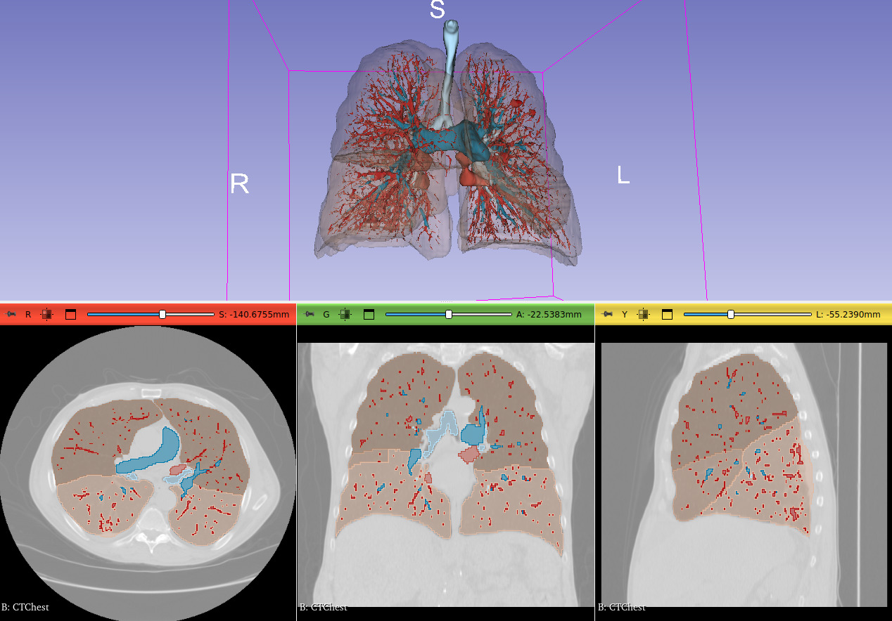

# MONAIAuto3DSeg

Extension for [3D Slicer](https://www.slicer.org) for fully automatic AI segmentation of images using [MONAI Auto3DSeg models](https://docs.monai.io/en/stable/auto3dseg.html).

Models are automatically downloaded and stored in the user's home folder within `.MONAIAuto3DSeg` subfolder.

## Setup

1. Setup your GPU driver (optional)

If you have a powerful GPU is available then a full-quality segmentation can be computed in a few minutes, instead of hours on the CPU. Therefore, it is recommended to set up GPU acceleration as described in this section.

- If a strong GPU with 7GB or more memory is available:
  - On Windows:
    - If using NVIDIA GPU: Make sure CUDA is installed. [CUDA version must be one of those listed on pytorch website as "Compute platform" for your system](https://pytorch.org/get-started/locally/). You can download CUDA from [here](https://developer.nvidia.com/cuda-downloads).
    - PyTorch does not officially support AMD GPUs for on Windows, therefore you need to use the CPU.
  - On Linux:
    - If using NVIDIA GPU: Make sure NVIDIA drivers are installed. If CUDA is installed then make sure [CUDA version is one of those listed on pytorch website as "Compute platform" for your system](https://pytorch.org/get-started/locally/). If CUDA is not installed then it will be set up automatically during installation (pytorch binary packages contain the appropriate CUDA version).
    - If using AMD GPU: In theory, ROCm-compatible AMD GPUs should work, but this is not tested.
  - On macOS: PyTorch might be able to use some harware acceleration, but this is not tested.
- If suitable GPU is not available: Graphics driver updates or CUDA installation is not necessary, everything will still work, it will just take more time.

2. Install latest version of [3D Slicer](https://slicer.readthedocs.io/en/latest/user_guide/getting_started.html#installing-3d-slicer)

3. [Install `MONAIAuto3DSeg` extension in 3D Slicer](https://slicer.readthedocs.io/en/latest/user_guide/extensions_manager.html#install-extensions)

## Tutorial

- Start 3D Slicer
- Go to `Sample Data` module and load `CTA Abdomen (Panoramix)` data set
- Go to `MONAI Auto3DSeg` module
- Select `Input volume` -> `Panoramix-cropped`
- Click `Apply`
  - When this module is used the first time:
    - It needs to download and install PyTorch and TotalSegmentator Python packages and weights for the AI models. This can take 5-10 minutes and several GB disk space.
  - Expected computation time:
    - With CUDA-capable GPU: `TotalSegmentator 17 segments` task should be completed within one minute.
    - Without GPU: tens of minutes.
- To display the segmentation in 3D: click the `Show 3D` button

## User interface

- Inputs
  - Input volume: input CT image
  - Segmentation task: currently, all models are experimental (slow, not high quality)
- Outputs
  - Segmentation: it will contain a brain segment, which specifies the brain region
  - Show 3D: show/hide segments in 3D views
- Advanced:
  - Use standard segment names: use names defined in standard terminology files from [DCMQI](https://github.com/QIICR/dcmqi) (enabled by default). If disabled then internal names will be used as segment names.
  - Force reinstall: force reinstallation of the AI engine - TotalSegmentator Python package. This may be needed if other modules compromise the installation.
  - Get Python package information: retrieve installed version of the AI engine.

## Troubleshooting

### Segmentation fails

Problem: Segmentation fails while predicting and the `RuntimeError: CUDA out of memory.` message is found in the message log (textbox under the Apply button).

Explanation: This means that a CUDA-capable GPU is available, but it is not powerful enough for the chosen task.

Solution: It is recommended to switch to use the CPU by the following steps:
- Go to `PyTorch Util` module, click `Uninstall PyTorch`. An error may be reported at the end of this step, as some PyTorch files are in use. Click `Restart the application` button to unload all PyTorch files.
- Go to `PyTorch Util` module, select `cpu` as `Computation backend`, and click `Install PyTorch`.

If your GPU has more than 7GB memory and you still get this error then the error message might indicate that the PyTorch CUDA version does not match the CUDA version installed on the system. Reinstall PyTorch with the correct CUDA version by following the instructions given below for [GPU is not found](#gpu-is-not-found).

### GPU is not found

Problem: Your computer has a CUDA-capable GPU but TotalSegmentator reports that GPU is not available.

Explanation: CUDA may not be installed on the system or CUDA version in PyTorch does not match the system CUDA version.

Solution:
- Make sure that the the CUDA vesion installed on the system [is one of those listed on pytorch website as "Compute platform" for your system](https://pytorch.org/get-started/locally/). You can download CUDA from [here](https://developer.nvidia.com/cuda-downloads).
- Go to `PyTorch Util` module, click `Uninstall PyTorch`. An error may be reported at the end of this step, as some PyTorch files are in use. Click `Restart the application` button to unload all PyTorch files.
- Go to `PyTorch Util` module, select the `Computation backend` that matches the system CUDA version, and click `Install PyTorch`. The CUDA computational backend name has the format `cuNNN`, where _NNN_ corresponds to the CUDA major+minor version. For example, CUDA 11.7 backend name is `cu117`.

### Segmentation is inaccurate

Currently, all models are experimental. It is expected that they are not accurate and computation time is not optimal.

### Fail to download model files

Model files are hosted on github.com and downloaded automatically when segmenting the first time. Institutional firewall or proxy servers may prevent access or the server may be temporarily overloaded. Potential solutions:
- retry later when the server may be less overloaded
- talk to IT administrators or use a VPN to access the server
- download the file manually from https://github.com/lassoan/SlicerMONAIAuto3DSeg/releases/download/Models/ and unzip it in the `.MONAIAuto3DSeg\models` folder in the user's profile (for example in `c:\Users\(yourusername)\.MONAIAuto3DSeg\models\17-segments-TotalSegmentator`)

## Contributing

Contributions to this extensions are welcome. Please send a pull request with any suggested changes. [3D Slicer contribution guidelines](https://github.com/Slicer/Slicer/blob/main/CONTRIBUTING.md) apply.

## Contact

Please post any questions to the [Slicer Forum](https://discourse.slicer.org).
